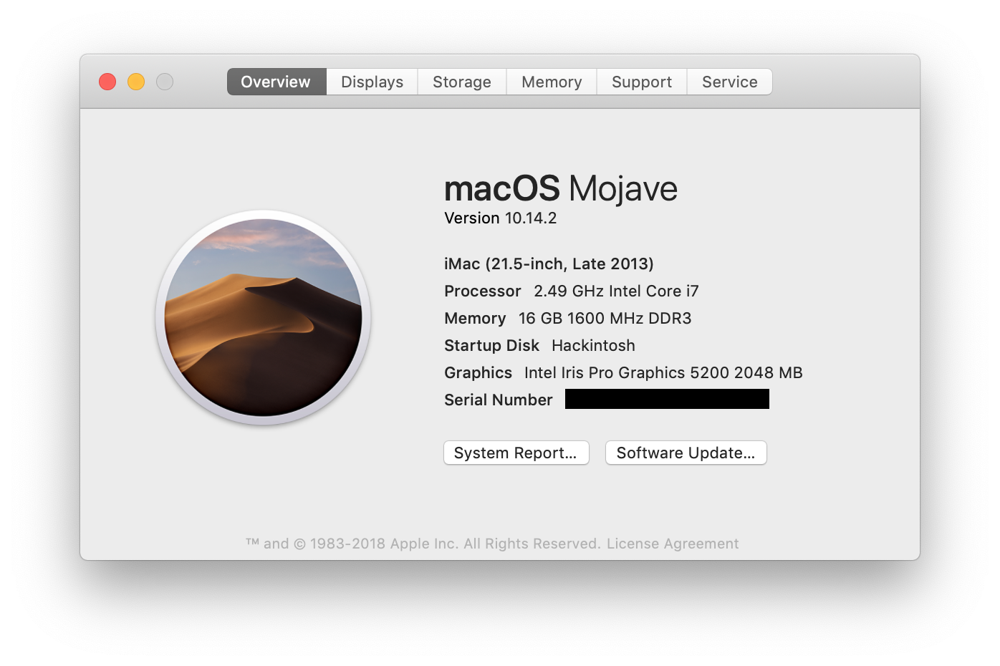

# Dell OptiPlex 9020m 黑苹果（Hackintosh）安装指南

## 概述

[Dell OptiPlex 9020m](https://www.dell.com/support/home/ae/en/aebsdt1/product-support/product/optiplex-9020m-desktop/diagnose) 是款 Q87 芯片组的小型个人 PC，目前（2019年初）二手市场的准系统价格大概在 400-500 上下，由于使用了 4 代的 Intel CPU，可以安装魔改的移动 i7 处理器，所以具有很高的性价比。

原来已经 Hackintosh 一台[联想的 ThinkCenter M93p](https://github.com/mingcheng/lenovo-thinkcentre-m93p-hackintosh) 机子，观察到 9020m 和它的芯片组都是为 Q87 芯片组，同时相比可以多搭载快 Sata 硬盘（分别是 Sata 和 M2 接口），同时还能使用 ngff 接口的无线网卡，因此又考虑多黑一台机子。


简单的说，这台机子的优势是：

1. 可以使用四代魔改移动的 CPU，比较低的价格就可以上 i7 八核；
2. 安装双硬盘，支持时间胶囊；
3. 网卡使用 ngff 接口，可以搭配转接口使用 Apple 的原装无线和蓝牙模块；
4. 硬件保有量比较大，维修和替换比较方便。

## 硬件介绍

硬件方面从淘宝购买了准系统以及 4870HQ 的 CPU、两根 8g 的 DDR3 1600 三星内存条、固态硬盘为来自京东的三星 860 EVO 、蓝牙和无线网卡使用 MacBook Air 拆机的 BCM943224，搭配了 ngff 转接卡，同时 Sata 硬盘位安装了拆机的 500g 日立机械硬盘用作时间胶囊。



总体模拟为 iMac14.1 ，根据目前运行的情况完美的部分为：

1. 完美睡眠（休眠）唤醒，同时开启 HiDPI 支持 2k 显示器；
2. USB 端口、有线网卡、声卡均可以正常工作；
3. 通过注入 SSDT 搭配 CPUFriend 能够实现变频；
4. WIFI 和蓝牙能够正常使用，同时支持蓝牙键盘唤醒（还有部分不完美，需要观察）；
5. AirDrop 能够正常使用，iMessage 还为测试；
6. 可以读取风扇转速、CPU 温度、硬盘温度等。

还有不足的地方：

1. 开机 USB 鼠标会有卡顿，大概 10s 以后恢复正常；
2. 蓝牙连接会有时会有卡顿的现象，目前已经注入 BrcmPatchRAM2 工作正常，但仍需要观察。


## 安装指南

### BIOS 设置

Dell 的机子相比联想的机子在 BIOS 上操作比较复杂（个人不是很喜欢使用鼠标操作设置 BIOS），因此请务必小心和检查 BIOS 设置是否都已经生效。

通常二手的机子使用的时间都比较长，可能从来没有更换过 CMOS 电池，同时建议收到二手的机子以后，更换 CMOS 电池（这点是比较血泪的教训），9020M 的 CMOS 电池型号是 CR2032 。

设置对应的 BIOS，英文对照：

* Boot sequence -> UEFI
* Advanced Boot Options -> Uncheck Enable Legacy Option ROMs - (only if graphics are UEFI capable)
* Serial Port -> Disabled
* Sata Operation -> AHCI
* Integrated NIC -> Enabled
* Secure Boot -> Disabled

然后重启即可。

### 显卡

本机搭配的是 [4870HQ 搭配了 Iris™ Pro Graphics 5200 的核心显卡](https://ark.intel.com/products/83504/Intel-Core-i7-4870HQ-Processor-6M-Cache-up-to-3-70-GHz-)，可以正确被 Mojave 驱动，同时通过打 FrameBuffer 补丁以后显示 2048m 的显存。目前，主要通过 WhateverGreen 驱动以及使用 FB-Patcher 打补丁。

```
<key>ig-platform-id</key>
<string>0x0d220003</string>
```

然后打上对应的补丁

```
	<key>PciRoot(0x0)/Pci(0x2,0x0)</key>
	<dict>
		<key>framebuffer-patch-enable</key>
		<data>
		AQAAAA==
		</data>
		<key>framebuffer-unifiedmem</key>
		<data>
		AAAAgA==
		</data>
	</dict>
```

然后就可以看到运行正常了：


### 声卡

9020m 的声卡型号是 ALC255，注入 id 为 27 。使用的是 AppleALC 注入的合适，没有修改对应的 DSDT。

```
	<key>PciRoot(0x0)/Pci(0x1b,0x0)</key>
	<dict>
		<key>layout-id</key>
		<data>
		GwAAAA==
		</data>
	</dict>
```

<!--
### 网卡和蓝牙


### CPU 变频


### 其他和 DSDT


## 安装后

sudo xattr -r -d com.apple.quarantine /Applications


## 参考资源

-->