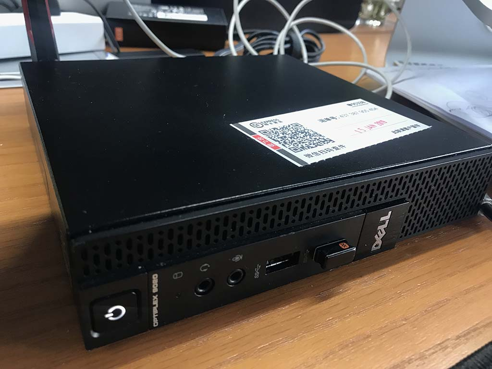
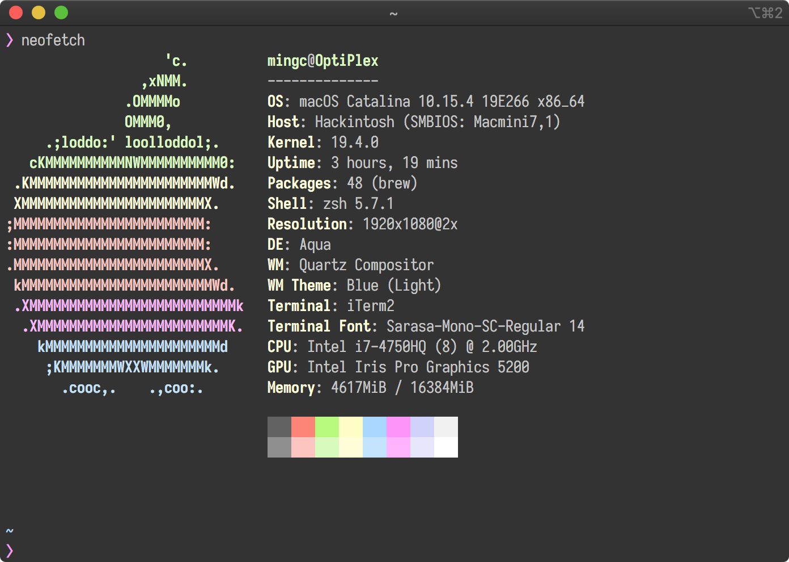
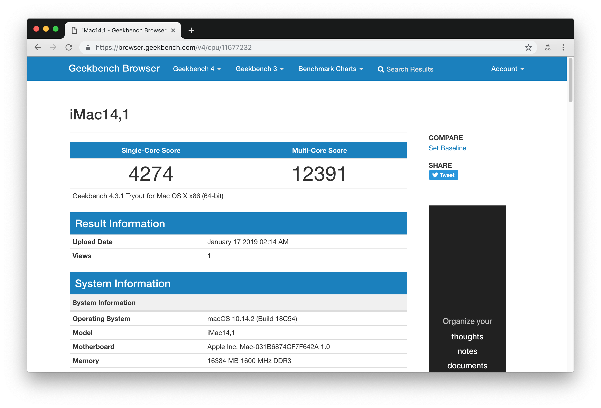
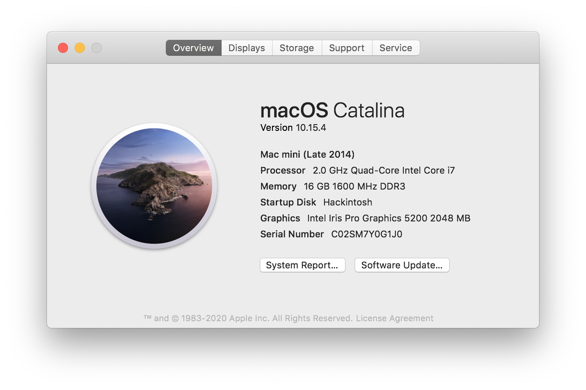
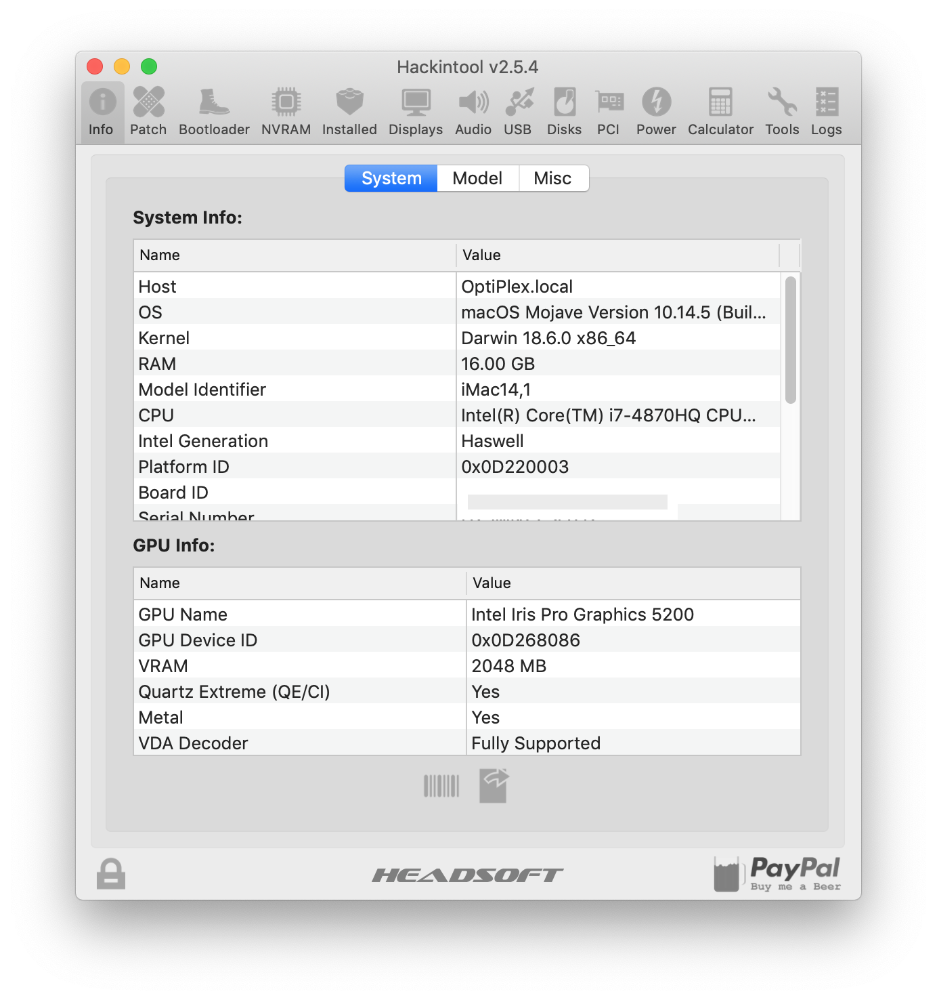
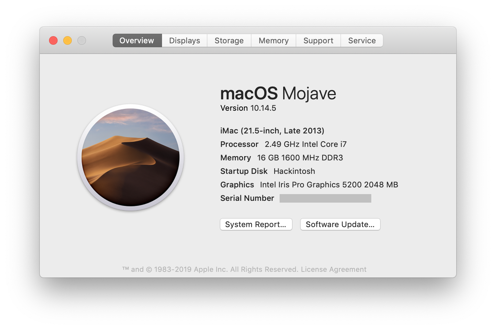
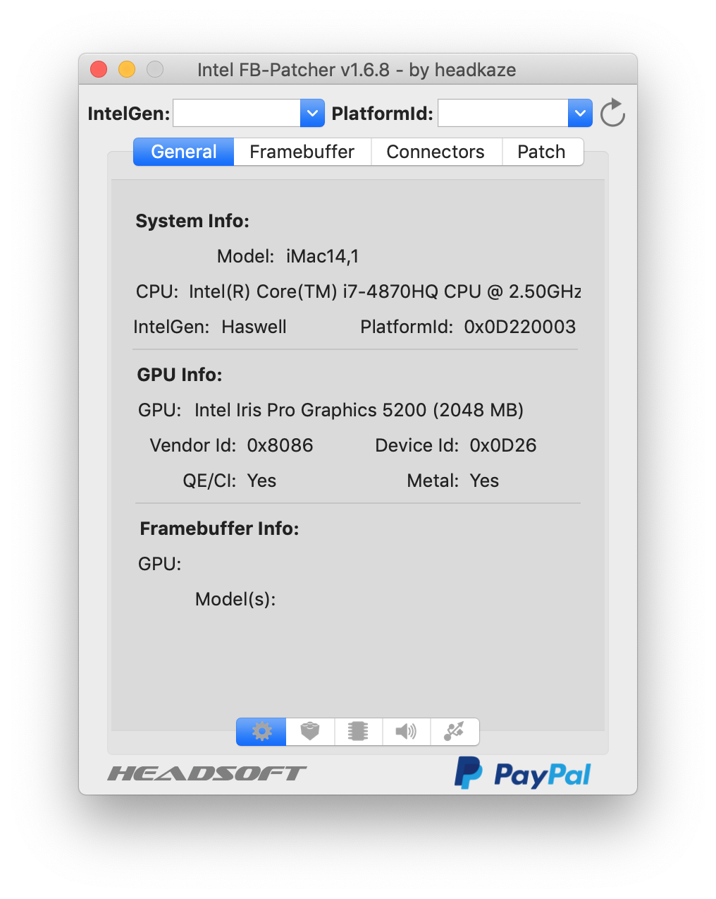
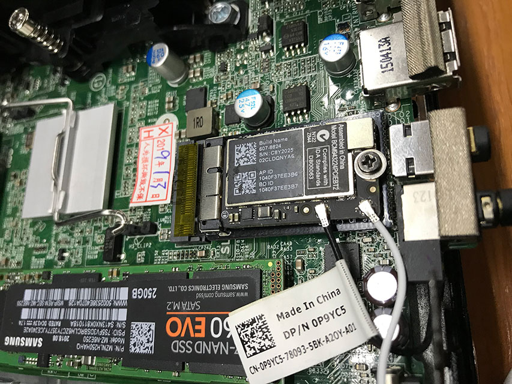
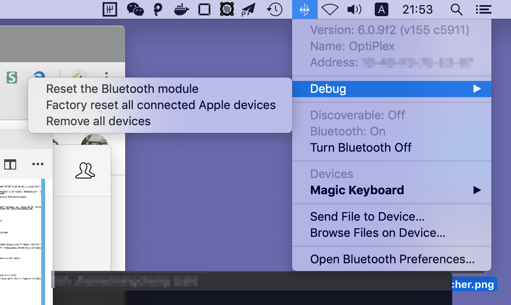
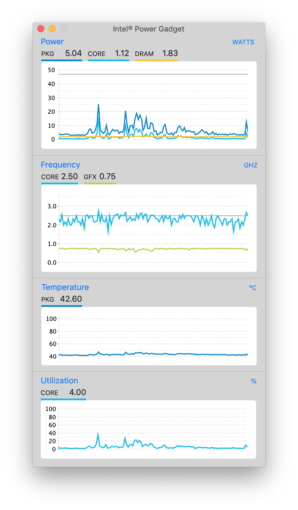

# Dell OptiPlex 9020M 黑苹果（Hackintosh）安装指南



## 目录

<!-- TOC depthFrom:2 depthTo:4 orderedList:false -->

- [目录](#目录)
- [概述](#概述)
- [更新记录](#更新记录)
  - [2020-04-02](#2020-04-02)
  - [2020-03-31](#2020-03-31)
  - [2019-07-27](#2019-07-27)
  - [2019-07-26](#2019-07-26)
  - [2019-06-12](#2019-06-12)
  - [2019-05-28](#2019-05-28)
  - [2019-05-22](#2019-05-22)
  - [2019-05-21](#2019-05-21)
  - [2019-03-31](#2019-03-31)
  - [2019-01-23](#2019-01-23)
  - [2019-01-09](#2019-01-09)
- [硬件介绍](#硬件介绍)
- [安装指南](#安装指南)
  - [BIOS 设置](#bios-设置)
  - [显卡](#显卡)
  - [声卡](#声卡)
  - [网卡和蓝牙](#网卡和蓝牙)
  - [CPU 变频](#cpu-变频)
  - [其他](#其他)
- [其他](#其他-1)
  - [安装后](#安装后)
  - [FAQ](#faq)
  - [参考资源](#参考资源)

<!-- /TOC -->

## 概述



[Dell OptiPlex 9020m](https://www.dell.com/support/home/ae/en/aebsdt1/product-support/product/optiplex-9020m-desktop/diagnose) 是款 Q87 芯片组的小型个人 PC，目前（2019 年初）二手市场的准系统价格大概在 400-500 上下而且保有量巨大，具有很高的性价比。

原来已经有一台 Hackintosh 了，来自[联想的 ThinkCenter M93P](https://github.com/mingcheng/lenovo-thinkcentre-m93p-hackintosh) 机子，观察到 9020m 和它的芯片组都是为 Q87 芯片组，同时相比可以多搭载块硬盘（分别是 SATA 和 M2 8020 接口），因此又考虑多黑一台机子。



简单的说，这台机子硬件方面的优势是：

1. 可以使用四代魔改移动的 CPU，比较低的价格就可以上 i7 八核；
2. 安装双硬盘，用于时间胶囊可以做到数据增量备份；
3. 网卡使用 ngff 接口，可以搭配转接口使用 Apple 的原装无线和蓝牙模块；
4. 硬件保有量比较大，维修和替换比较方便。

在黑苹果的兼容性方面，<del>总体模拟为 `iMac14.1` （参见 `config.plist` 配置文件）</del> 自更新到 10.15.4 以后，模拟为 Macmini 2014 款 ，根据目前运行的情况完美的部分为：

1. 完美睡眠（休眠）唤醒，同时开启 HiDPI 支持 2k 显示器；
2. USB 端口、有线网卡、声卡均可以正常工作；
3. 通过注入 SSDT 搭配 CPUFriend 能够实现变频；
4. WIFI 和蓝牙能够正常使用，同时支持蓝牙键盘唤醒<del>（还有部分不完美，需要观察）</del>；
5. AirDrop 能够正常使用，iMessage 还未经测试；
6. 可以读取风扇转速、CPU 温度、硬盘温度等。

还有不足的地方：

1. 开机 USB 鼠标会有卡顿，大概 10s 以后恢复正常；
2. <del>蓝牙连接会有时会有卡顿的现象，目前已经注入 BrcmPatchRAM2 工作正常，但仍需要观察。</del> 注1：在 `/L/E` 中注入了 `BrcmFirmwareData.kext` 和 `BrcmPatchRAM2.kext` 解决。注2：系统升级到 10.15.4 以后，直接使用原生的驱动，不用做更多的操作。

## 更新记录

### 2020-04-02

系统更新到 10.15.4（还是没有忍住，哈），更新了 Clover 最新版本以及精简了很多内核以及配置，目前挂机 48 小时没有任何的问题，但是 USB 启动还是会有几十秒钟的卡顿。



### 2020-03-31

系统更新到 10.14.6 [18G4032](https://support.apple.com/en-us/HT211100), 更新内核模块以及 Clover 到最新版本。

### 2019-07-27

升级到 10.14.6，没有出现任何的异常。

### 2019-07-26

更新部分 kexts 版本号，同时更新 Clover 到最新版本（5018）。

### 2019-06-12

淘汰 FakeSMC，替换使用 VirtualSMC: https://www.tonymacx86.com/threads/virtualsmc-or-fakesmc.264315/

### 2019-05-28

例行更新到 Clover 到最新版本，更新比较核心（`WhateverGreen` 以及 `Lilu` 和 `AppleALC`）的 kexts 的版本。

### 2019-05-22

尝试使用了 [Hackintool](https://www.tonymacx86.com/threads/release-hackintool-v2-5-1.254559/) 这个工具，通过这个工具更新了 Clover 以及必要的几个 kexts ，推荐使用这个工具非常的好用。



### 2019-05-21

平滑升级到了 10.14.5，更新了 `WhateverGreen` 以及 `Lilu` 和 `AppleALC` 驱动，[并打了 USB 相关的补丁](https://www.tonymacx86.com/threads/mojave-10-14-5-port-limit-removal-patch.277166/)，没有发现任何的异常。

详细的使用介绍参见： https://blog.daliansky.net/Intel-FB-Patcher-tutorial-and-insertion-pose.html



### 2019-03-31

升级到 10.14.4 出现了问题，重启更新的时候发现卡在了启动阶段，但最终还是升级到了 10.14.4。后来根据 Tonymacx86 的帖子更新了 `Clover r4586` 到 `r4862` 后解决（使用 tonymacx86 的编译包），目前没有发现任何的异常。

参考和下载链接：

- https://www.tonymacx86.com/threads/macos-10-14-4-update.274017/
- https://www.tonymacx86.com/resources/categories/kexts.11/
- https://www.tonymacx86.com/resources/categories/clover-builds.12/

在 `Clover r4862` 安装好了以后，`drivers64UEFI` 目录下是没有 `ApfsDriverLoader-64.efi` 以及 `AptioMemoryFix-64.efi` 等文件的。这样子，可能会造成无法识别 APFS 文件系统的引导，因此需要手工拷贝这几个文件到对应新安装的 Clover EFI 目录中。

同时更新了内核扩展模块的版本，以及合并和清除了部分多余的内核扩展，重启后持续运行几天目前不影响正常的使用。

### 2019-01-23


已经通过安装包平滑升级到 10.14.3，升级过程没有发现任何的问题。

### 2019-01-09

初始化安装 10.14.2，相对比较完美了。

## 硬件介绍

个人在这台机子上的硬件方面：

- 从淘宝购买了准系统以及 4870HQ 的 CPU，套餐价格为 ¥1290；
- <del>两根 8g 的 DDR3 1600 三星内存条</del> 更换为两条尔必达（Elpida） DDR3 1600 内存；
- 固态硬盘为来自京东渠道的三星 860 EVO（SATA 协议），后期加装了散热片；
- 蓝牙和无线网卡使用 MacBook Air 拆机的 BCM943224，搭配了 ngff 转接卡；
- <del>同时 SATA 硬盘位安装了拆机的 500g 日立机械硬盘用作时间胶囊</del> <del>更换为全新的希捷 SSHD 5400rpm 1T 的混合机械硬盘，用于时间胶囊的备份和大文件存储。</del> 20200331 更新：拆除机械硬盘，使用网络备份的方式使用时间胶囊。

总体来说，个人的策略就是出于数据安全的考虑，存储这块必须是有明确渠道的，最好是全新的。

稳定性方面，到手以及黑苹果安装基本完毕会使用 stress 烤机 72 小时后再继续使用。

## 安装指南

### BIOS 设置

Dell 的机子的 BIOS 相比联想的机子在交互上操作较复杂（个人不是很喜欢使用鼠标操作设置 BIOS），因此请务必小心和检查 BIOS 设置是否都已经生效。

顺便说句，通常二手的机子使用的时间都比较长，可能出厂后就没有更换过 CMOS 电池。建议收到二手的机子以后，更换 CMOS 电池（这点是比较血泪的教训）。Dell 9020M 的 CMOS 电池型号是 CR2032 。

针对黑苹果，设置对应的 BIOS：

- Boot sequence -> UEFI
- Advanced Boot Options -> Uncheck Enable Legacy Option ROMs - (only if graphics are UEFI capable)
- Serial Port -> Disabled
- Sata Operation -> AHCI
- Integrated NIC -> Enabled
- Secure Boot -> Disabled

### 显卡

本机搭配的是 [4870HQ 搭配了 Iris™ Pro Graphics 5200 的核心显卡](https://ark.intel.com/products/83504/Intel-Core-i7-4870HQ-Processor-6M-Cache-up-to-3-70-GHz-)，可以正确被 Mojave 驱动，同时通过打 FrameBuffer 补丁以后显示 2048m 的显存。目前，主要通过 WhateverGreen 驱动以及使用 FB-Patcher 打补丁。

```xml
<key>ig-platform-id</key>
<string>0x0d220003</string>
```

然后打上对应的补丁

```xml
<key>PciRoot(0x0)/Pci(0x2,0x0)</key>
<dict>
	<key>framebuffer-patch-enable</key>
	<data>
	AQAAAA==
	</data>
	<key>framebuffer-unifiedmem</key>
	<data>
	AAAAgA==
	</data>
</dict>
```

然后就可以看到运行正常了：



### 声卡

9020m 的声卡型号是 ALC255，注入 id 为 27 。使用的是 AppleALC 注入的合适，没有修改对应的 DSDT。

注意：不要使用通用的 DSDT 中的 Layout3 Fixed Patch，打完这个补丁有可能会造成音频失真的问题，除非你知道怎么解决它。

```xml
<key>PciRoot(0x0)/Pci(0x1b,0x0)</key>
<dict>
	<key>layout-id</key>
	<data>
	GwAAAA==
	</data>
</dict>
```

经过测试，这样子设置以后就可以完美使用（由于没有需要，麦克风没测试），具体更多的设置方法请参见教程：

http://blog.daliansky.net/Use-AppleALC-sound-card-to-drive-the-correct-posture-of-AppleHDA.html

### 网卡和蓝牙

网卡和蓝牙这块替换了苹果提供的 `BCM943224` 然后使用转接卡转接到 ngff 插口上，硬件方面这个网卡的尺寸刚刚好可以容纳主机的空间，如下图：



注意蓝牙天线以及 Wifi 天线的插头位置（我插反过，然后 Wifi 和蓝牙的信号都很差）。虽然这个网卡可以免驱动就可以使用，但是还是建议注入后使用，具体的方式参见：

https://www.tonymacx86.com/threads/broadcom-wifi-bluetooth-guide.242423/

目前的问题是有部分时候蓝牙键盘连接会有卡顿的现象。解决的方案是同时按 `Command + Option` 然后点击蓝牙图标，就可以弹出调试菜单：



初始化蓝牙模块以及已连接的 Apple 设备后，再重新插拔下就可以使用，但目前没有再发生卡顿的情况，还是需要观察。

更新（2019-01-23）：经过一周的测试，在 `/L/E` 中注入了 `BrcmFirmwareData.kext` 和 `BrcmPatchRAM2.kext` 没有发生卡顿的现象。

### CPU 变频

本机搭配了 4870HQ 的 CPU，变频这块可以参考 EFI 中 `ACPI/dsl/SSDT-0-CpuFriend.sdl` 这个文件，以下是效果：



待机温度能够有效控制在 50 度以内。相比 ThinkCenter M93P 的 4720HQ 从运行温度的角度上说，这块 CPU 对温度的控制总体温度低点。所以，相对 4720HQ，推荐使用 4870HQ 这块 CPU。

### 其他

映射正确的 SATA 方式，避免造成启动的时候磁盘顺序混乱，因此需要在 ACPI 下打个补丁

```xml
<dict>
	<key>Comment</key>
	<string>change SAT0 to SATA</string>
	<key>Disabled</key>
	<false/>
	<key>Find</key>
	<data>
	U0FUMA==
	</data>
	<key>Replace</key>
	<data>
	U0FUQQ==
	</data>
</dict>
```

来源出处参考这里： https://hackintosh.gitbook.io/-r-hackintosh-vanilla-desktop-guide/

## 其他

### 安装后

隐藏第三方启动「允许任何来源的应用」选项

```
sudo spctl --master-disable
```

强制开启第三方 SSD 的 Trim 功能

```
sudo trimforce enable
```

删除启动确认的对话框，通常通过 Brew 等渠道的安装包：

```
sudo xattr -r -d com.apple.quarantine /Applications
```

提取 EDID，以及注入 DisplayVendorID 和 DisplayProductID

```
ioreg -lw0 | grep -i "IODisplayEDID" | sed -e 's/.*<//' -e 's/>//'
ioreg -lw0 | grep IODisplayPrefsKey
```

### FAQ

A：运行稳定吗？
Q：装机以后直接使用 stress 烤机 48 小时（扔公司，过了个周末），满载 CPU 温度 80-90 度无死机、重启等现象，使用过程中目前已经超过两周无死机现象，<del>uptime 目前最高达到 5days。</del> 20190902 更新: UPTIME 目前最高到三是多天了，已经非常稳定了。

A：支不支持 4K 分辨率？
Q：我使用的是 2K 显示器开了 HiDPI 实际分辨率为 `3840x2160@60Hz` 使用分辨率为 `1920x1080`，[这应该是 4870HQ 核显 DP 端口的最大分辨率了](https://ark.intel.com/products/83504/Intel-Core-i7-4870HQ-Processor-6M-Cache-up-to-3-70-GHz-)。所以是支持 4K 分辨率的，不过由于是四代的 CPU 核显就别指望它玩游戏了。

### 参考资源

- https://www.tonymacx86.com/threads/release-hackintool-v2-5-1.254559/
- https://comsysto.github.io/Display-Override-PropertyList-File-Parser-and-Generator-with-HiDPI-Support-For-Scaled-Resolutions/
- https://www.tonymacx86.com/threads/broadcom-wifi-bluetooth-guide.242423/
- https://www.tonymacx86.com/threads/an-idiots-guide-to-lilu-and-its-plug-ins.260063/
- https://blog.daliansky.net/Mac-frequently-used-to-the-command---continuous-update.html
- https://hackintosh.gitbook.io/-r-hackintosh-vanilla-desktop-guide/

`- eof -`
